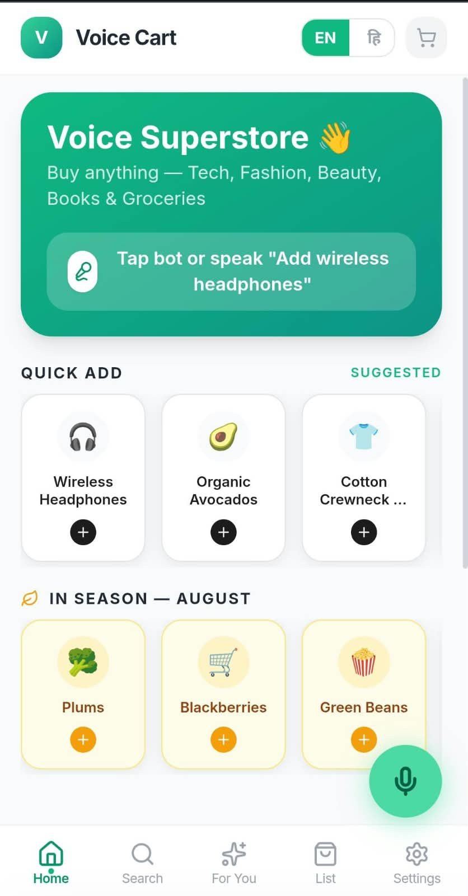
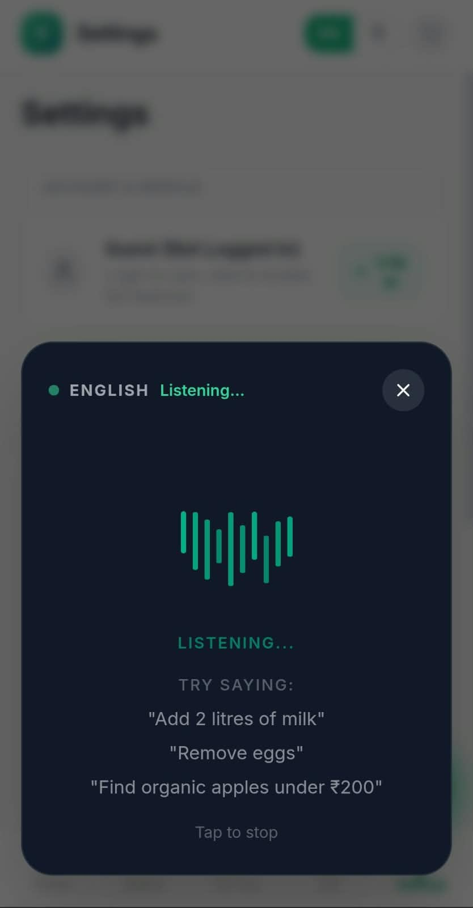
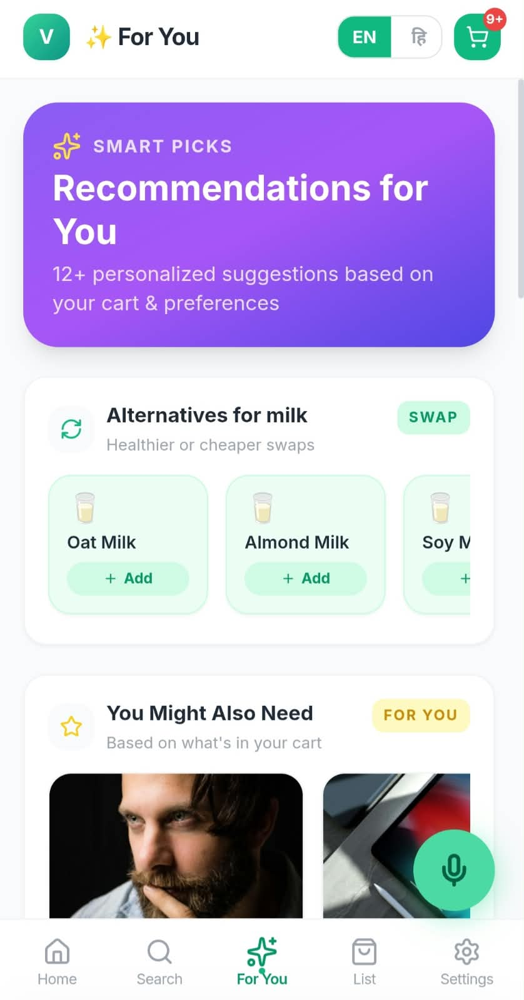

# Voice Cart

**A voice-first, bilingual shopping assistant built with React 19, TypeScript, Tailwind CSS v3, and the Web Speech API.**

[](https://voice-cart-zhf4.vercel.app/)
[](./LICENSE)

**Live Demo:** https://voice-cart-zhf4.vercel.app/
**Repository:** https://github.com/shreyagaur-10/voicecart

---

## 📸 Application Interface & Visual Previews





## Overview

Voice Cart is a responsive, voice-driven shopping assistant designed for mobile and web. It combines the browser's native `SpeechRecognition` API with a deterministic, rule-based NLU engine (`commandParser.ts`) to deliver low-latency voice command parsing in English (`en-US`) and Hindi (`hi-IN`) with no cloud dependency or associated API costs.

### Core Design Principles

1. **Client-side speech and intent parsing** — Voice input is parsed into structured intents (`add`, `remove`, `search`, `clear`) with entity extraction for quantities (numeric and spoken, e.g. *"a dozen"*), units (`litres`, `packs`), and price filters (e.g. *"under ₹5000"*).
2. **Bilingual i18n and catalog mapping** — Full UI localization with automatic keyword mapping between spoken English/Hindi terms and inventory categories, across 19 product categories.
3. **Dynamic recommendation engine** — Custom React hooks (`useShoppingList`, `useVoiceInput`) drive automated recommendations, including low-stock alerts from purchase history, seasonal produce by calendar month, and product substitutions.
4. **Resilient UX** — Out-of-stock items trigger instant toast feedback, and checkout actions launch an interactive "Payment Coming Soon" modal.

---

## Key Features

| Feature | Description |
| :--- | :--- |
| 🎙️ Bilingual Voice Recognition | Hands-free commands in English (`en-US`) and Hindi (`hi-IN`) |
| 🌐 Instant Language Toggle | Switches UI strings, product names, categories, and toasts between English and Hindi |
| 🔐 Auth & Guest Access | Persistent logged-in session or instant guest browsing via `localStorage` |
| 🛍️ Smart Recommendations | "Running Low" restock alerts, seasonal produce picks, and substitution suggestions |
| 📦 Categorized Shopping List | Cart items dynamically grouped across 19 categories (Electronics, Clothing, Groceries, Books, Sports, etc.) |
| 💳 Checkout Preview | Interactive modal displaying cart summary and security highlights on checkout attempt |

---

## Architecture

```
User Speaks Command
        │
        ▼
Web Speech API (en-US / hi-IN)
        │  transcript text
        ▼
Rule-Based NLU Command Parser
        │  action, item, quantity, category
        ▼
Intent Handler / Availability Check
        │
   ┌────┴─────────────────────┐
   ▼                          ▼
Item Available          Product Unavailable
 ├─ Add to shopping list   └─ Trigger toast notification
 ├─ Update estimated total
 └─ Persist to localStorage
```

---

## Tech Stack

- **Framework:** React 19, TypeScript
- **Styling:** Tailwind CSS v3
- **Speech:** Web Speech API (`SpeechRecognition`)
- **Testing:** Vitest
- **State/Persistence:** Custom React hooks, `localStorage`

---

## Getting Started

### Prerequisites
- Node.js and npm
- Google Chrome or Microsoft Edge (for full Web Speech API support)

### Installation

```bash
git clone https://github.com/shreyagaur-10/voicecart.git
cd voicecart
npm install
npm run dev
```

Then open `http://localhost:5173` in Chrome or Edge.

### Running Tests

```bash
npm run test
```

Unit tests cover command parsing logic, quantity extraction, category auto-mapping, and Hindi keyword parsing.

---

## Voice Commands

| Action | Example Commands |
| :--- | :--- |
| Add Item | `"Add milk"`, `"Add earphones"`, `"Add 2 shirts"` |
| Remove Item | `"Remove milk"`, `"Remove earphones"` |
| Search Catalog | `"Find earphones under ₹5000"`, `"Search shirts"` |
| Clear List | `"Clear shopping list"` |

---

## Authentication & Storage

- **Logged-in sessions** are tracked via `localStorage.getItem('user_email')`.
- **Guest access** is enabled via `localStorage.getItem('is_guest')`, allowing immediate use without sign-in.
- **Cart and purchase history** are persisted entirely in browser `localStorage`.

---

## Known Limitations

- **Browser support:** The Web Speech API requires Chrome or Edge. Safari offers partial support; Firefox requires manual flag configuration.
- **No backend sync:** Data is stored locally and is not synced to a cloud database.
- **Mock catalog:** Product data and pricing are statically defined for demonstration and are not connected to a live inventory system.
- **NLU scope:** The intent parser uses keyword/regex matching optimized for shopping commands, rather than a full LLM-based conversational engine.

---

## Documentation

See [`approach.md`](./approach.md) for a detailed technical deep dive covering the Web Speech API integration, rule-based NLU parser design, bilingual i18n architecture, state persistence, and recommendation algorithms.

---

## License

Distributed under the MIT License. See [`LICENSE`](./LICENSE) for details.
